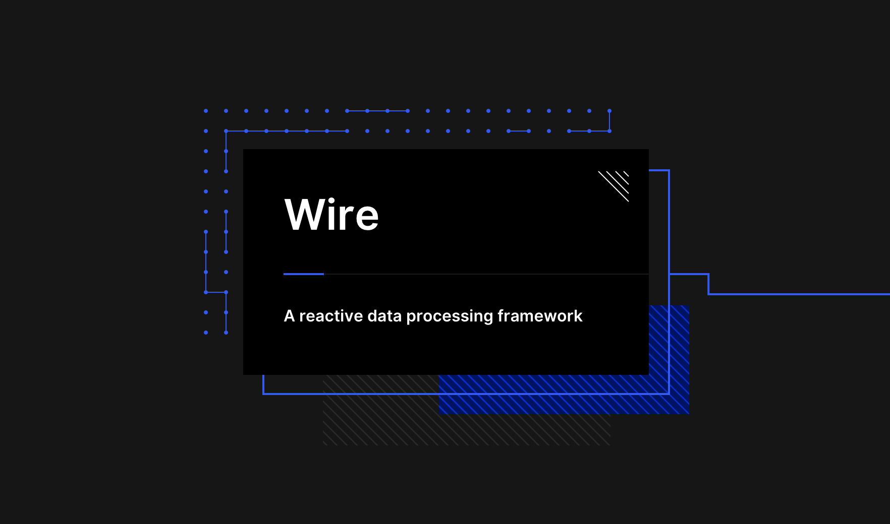

# Wire

[](https://circleci.com/gh/emilwidlund/wire)
[](https://opensource.org/licenses/MIT)

Wire is a processing framework written in TypeScript designed to process data in a reactive & unidirectional way.
It is primarily built to abstract data-flow in Node/Graph Editors & Visual Programming tools. Wire is powered by MobX which is a required, peer dependency.

Wire is still under development and not yet considered released.


### Nodes

Nodes are the most central entities in Wire. They are conceptually very similar to functions. A node consists of
input ports (much like a function's arguments), output ports (much like a function's return value) and a set of lifecycle
methods. The primary purpose of a Node is to process & derive data from input ports to output ports.

#### Lifecycle Methods

Nodes may define lifecycle methods that operates at certain points during a node's lifecycle:

-   initialize(): Runs whenever the node is created.
-   compute(): Runs when any input port's value is mutated. This is usually where you produce & populate values for your output ports.
-   dispose(): Runs whenever the node is destroyed.

### Connections

Connections are links that transports values between nodes' input & output ports. Connections may only be constructed between
output ports & input ports. Ports may also have validation functions that restricts connection compability between ports.
An output port may have multiple outgoing connections, while input ports are limited to 1 incoming connection.

### Installation

Wire is still under development and not available on npm at this time.

### API Documentation

Coming soon.

### Examples

#### Basic usage

```typescript
// Import the Context class & the built-in AdditionNode that comes with Wire by default
import { Context } from 'wire';
import { AdditionNode } from 'wire/nodes';

// Create a context which holds nodes & associated connections
const context: Context = new Context();

// Create two simple nodes that adds values
const nodeA = new AdditionNode(context);
const nodeB = new AdditionNode(context);

// Connect nodeA's output port "result" with nodeB's input port "a"
nodeA.outputPorts.result.connect(nodeB.inputPorts.a);
```

#### Defining a custom node

```typescript
import * as _ from 'lodash';

import { Node, NodeProps, NodeInputPorts, NodeOutputPorts, InputPort, OutputPort, Context } from 'wire';

export interface AdditionNodeInputPorts extends NodeInputPorts {
    a: InputPort<number>;
    b: InputPort<number>;
}

export interface AdditionNodeOutputPorts extends NodeOutputPorts {
    result: OutputPort<number>;
}

export class AdditionNode extends Node {
    inputPorts: AdditionNodeInputPorts;
    outputPorts: AdditionNodeOutputPorts;

    constructor(context: Context, props: NodeProps = {}) {
        _.defaultsDeep(props, {
            inputPorts: {
                a: {
                    defaultValue: 0
                },
                b: {
                    defaultValue: 0
                }
            },
            outputPorts: {
                result: {
                    defaultValue: 0
                }
            }
        });

        super(context, props);
    }

    compute() {
        const values: number[] = Object.values(this.inputPorts).map(ip => ip.value);
        const result: number = values.reduce((acc: number, val: number) => acc + val, 0);

        this.outputPorts.result.value = result;
    }
}
```

#### Serializing & Importing a Context

```typescript
import { Context } from 'wire';
import { AdditionNode } from 'wire/nodes';

const context: Context = new Context();

const nodeA = new AdditionNode(context);
const nodeB = new AdditionNode(context);

nodeA.outputPorts.result.connect(nodeB.inputPorts.a);

// Serialize Context into localStorage
const serializedContext = context.serialize();
localStorage.setItem('wire_context', serializedContext);

// Retrieve Context from localStorage
const serializedContextFromStorage = localStorage.getItem('wire_context');
// In order for Wire to "rebuild" your custom nodes, you need to pass those node classes in an object when importing
const importedContext = Context.import(serializedContextFromStorage, { CustomNodeA, CustomNodeB });

// The context is now successfully restored
```
